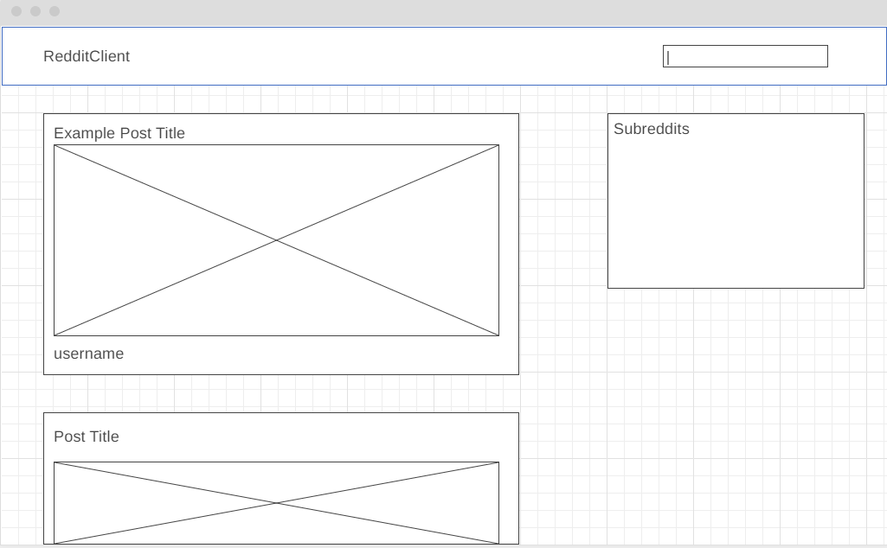

# Reddit Client Web Application

**Please Note, this application can be interacted with at the following URL:** https://nickpaduchowskiredditclient.netlify.app/

This is a repository for a basic Web Application I built which can be used to interact with Reddit. You can view a the main feed, which defaults to r/pics, or in the future, you will be able to pick your own subreddit to view from the list on the side. 

This application loads the 100 most recent posts.

## Technologies Used

A variety of technologies were used to create this application. The most prevelant technologies are as follows: 

 - ReactJS
 - Redux
 - HTML
 - CSS
 - Netlify (to deploy the application)

## Process

The process to create the app followed a standard procedure. 

First, I created a wireframe design. You can see this design below:

Then I created a sample react app to begin development. 

After creating the react app and ensuring it runs smoothly on my system, I set up the file structure for the components used and the Redux API calls. 

Once the file structure was setup, I began to create the layout of the site. 

First, I designed and implemented the navbar. Once the navbar was setup, I designed and implemented the post component and the subreddit component.

Once I was able to load posts, it was time to implement the upvoting and downvoting feature. This was simple enough to implement using conditional rendering. Along with conditional rendering, I used a handle upvote function to implement increasing the upvote count and a handle downvote function to implement decreasing the upvote count.

## To Do List

Some of the future features I plan to implement include:

 - Comment Section
 - Time Posted Feature
 - Link to Original Reddit Post
